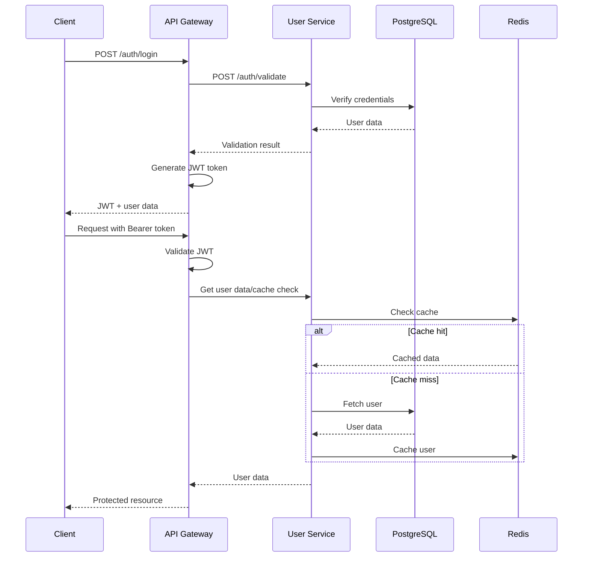

# System Architecture Overview


## Overview

This is a microservices-based notification system built with TypeScript and Node.js, implementing JWT authentication, message queuing, and real-time notification delivery.

## Core Technologies

- **Languages**: TypeScript (Node.js), Python (Template Service)
- **Frameworks**: NestJS (Node.js services), FastAPI (Template Service)
- **Database**: PostgreSQL with Prisma ORM
- **Queue System**: RabbitMQ
- **Cache & Session Management**: Redis
- **Email Provider**: SendGrid
- **Push Notifications**: Firebase Cloud Messaging (FCM)
- **Authentication**: JWT with global guard strategy
- **API Documentation**: Swagger/OpenAPI
- **Containerization**: Docker
- **Deployment Platform**: Leapcell Server

## Microservices Architecture

### 1. API Gateway (Port 3000)
**Technology**: NestJS (TypeScript)

**Responsibilities**:
- Central entry point for all client requests
- JWT authentication and authorization
- Request routing to appropriate microservices
- Rate limiting and request validation
- Notification queuing and status tracking

**Key Features**:
- Global JWT authentication guard with selective public access
- User service integration for credential validation
- Redis caching for user data and notification status
- RabbitMQ message publishing
- Comprehensive API documentation with Swagger

**Authentication Flow**:
- Public routes: `/auth/login`, `/auth/register`, `/gateway-health`
- Protected routes: All notification endpoints
- JWT token validation with user context extraction
- User preference checking before notification delivery

### 2. User Service (Port 3001)
**Technology**: NestJS (TypeScript) + PostgreSQL + Prisma

**Responsibilities**:
- User authentication and management
- User profile data storage
- Notification preferences management
- Password hashing with bcrypt
- User data caching

**Database Schema**:
```prisma
model User {
  id            String   @id @default(uuid())
  email         String   @unique
  password_hash String
  full_name     String
  push_token    String?
  is_active     Boolean  @default(true)
  created_at    DateTime @default(now())
  updated_at    DateTime @updatedAt
  
  preferences       NotificationPreference?
  notification_logs NotificationLog[]
}

model NotificationPreference {
  id            String   @id @default(uuid())
  user_id       String   @unique
  email_enabled Boolean  @default(true)
  push_enabled  Boolean  @default(true)
  created_at    DateTime @default(now())
  updated_at    DateTime @updatedAt
}

model NotificationLog {
  id            String             @id @default(uuid())
  user_id       String
  type          NotificationType
  status        NotificationStatus @default(PENDING)
  recipient     String
  subject       String?
  message       String
  error_message String?
  metadata      Json?
  sent_at       DateTime?
  created_at    DateTime           @default(now())
}
```

### 3. Email Service (Port 3002)
**Technology**: NestJS (TypeScript) + SendGrid API

**Responsibilities**:
- Email notification processing
- SendGrid API integration
- Email template management
- Delivery tracking and analytics
- Bulk email capabilities

**Queue Integration**:
- Consumes from `email_notifications` queue
- Publishes status updates to `notification_status` queue
- Retry logic for failed deliveries

### 4. Push Notification Service (Port 3003)
**Technology**: NestJS (TypeScript) + Firebase FCM

**Responsibilities**:
- Push notification processing
- Firebase Cloud Messaging integration
- Device token management
- Push notification analytics
- Bulk push capabilities

**Queue Integration**:
- Consumes from `push_notifications` queue
- Publishes status updates to `notification_status` queue
- Platform-specific message formatting

### 5. Template Service (Port 3004)
**Technology**: FastAPI (Python) + SQLModel

**Responsibilities**:
- Notification template management
- Template rendering and validation
- Dynamic content insertion
- Template versioning
- Multi-language support

**Features**:
- RESTful API for template CRUD operations
- Template preview functionality
- Variable substitution engine
- Template analytics and usage tracking

## Message Queue Architecture

### RabbitMQ Configuration

**Queues**:
1. **email_notifications**: Email message queue
   - TTL: 24 hours
   - Max length: 10,000 messages
   - Durable: Yes

2. **push_notifications**: Push notification queue
   - TTL: 24 hours
   - Max length: 10,000 messages
   - Durable: Yes

3. **notification_status**: Status update queue
   - TTL: 7 days
   - Max length: 50,000 messages
   - Durable: Yes

**Message Structure**:
```typescript
interface QueueMessage {
  notification_id: string;
  type: 'email' | 'push';
  data: any; // EmailNotificationDto or PushNotificationDto
  user_id?: string;
  timestamp: string;
  retry_count?: number;
}
```

### Queue Processing Flow

1. **API Gateway** publishes messages to appropriate queues
2. **Worker Services** consume messages from queues
3. **Status Updates** published to notification_status queue
4. **Status Worker** (TODO) processes status updates
5. **Redis** tracks real-time notification status
6. **PostgreSQL** persists notification history

## Database Architecture

### PostgreSQL (Primary Database)
- **User Management**: User profiles, authentication, preferences
- **Notification History**: Delivery tracking, analytics, logs
- **Template Storage**: Template definitions and versions
- **ACID Compliance**: Data integrity and consistency
- **Connection Pooling**: Optimized performance

### Redis (Cache & Session Store)
- **User Data Caching**: 1-hour TTL for user profiles
- **Notification Status**: Real-time status tracking
- **Session Management**: JWT token blacklisting
- **Rate Limiting**: Request throttling
- **Queue Metrics**: Performance monitoring

## Security Architecture

### JWT Authentication
- **Global Guard**: All routes protected by default
- **Public Decorator**: Selective public access
- **Token Validation**: Signature and expiration checks
- **User Context**: Request-scoped user data
- **Secure Storage**: bcrypt password hashing

### Authorization Flow


## API Documentation

### Swagger/OpenAPI Integration
- **Automatic Generation**: Type-safe API documentation
- **Interactive Testing**: Built-in API explorer
- **Authentication Examples**: JWT Bearer token usage
- **Response Schemas**: Detailed response models
- **Error Documentation**: Comprehensive error handling

### Key Endpoints

**API Gateway**:
- `POST /auth/login` - User authentication
- `POST /auth/register` - User registration
- `GET /gateway-health` - Health check
- `POST /notifications/email` - Send email notification
- `POST /notifications/push` - Send push notification
- `GET /notifications/:id/status` - Get notification status
- `POST /notifications/status` - Update notification status (workers)

**User Service**:
- `POST /auth/validate` - Credential validation
- `GET /users/:id` - Get user by ID
- `GET /users/email/:email` - Get user by email
- `GET /users/:id/preferences` - Get user preferences
- `POST /users/create-account` - Create new user

## Deployment Architecture

### Containerization
- **Docker**: Each service in isolated container
- **Docker Compose**: Development environment orchestration
- **Multi-stage Builds**: Optimized image sizes
- **Health Checks**: Container health monitoring

### Environment Configuration
- **Development**: Local development with hot reload
- **Staging**: Pre-production testing environment
- **Production**: Optimized for performance and security
- **Environment Variables**: Configuration management

### Leapcell Integration
- **Auto-scaling**: Horizontal scaling based on load
- **Load Balancing**: Traffic distribution
- **Service Discovery**: Automatic service registration
- **Monitoring**: Health checks and metrics

## Performance Optimizations

### Caching Strategy
- **Redis Caching**: User data, notification status
- **Connection Pooling**: Database connection optimization
- **Queue Batching**: Bulk message processing
- **CDN Integration**: Static asset delivery

### Scalability Features
- **Horizontal Scaling**: Multiple service instances
- **Queue Processing**: Parallel message processing
- **Database Sharding**: Potential future scaling
- **Microservice Independence**: Independent scaling

## Monitoring & Observability

### Logging
- **Structured Logging**: JSON format for all services
- **Log Levels**: Debug, Info, Warn, Error
- **Correlation IDs**: Request tracing across services
- **Log Aggregation**: Centralized log collection

### Metrics
- **Queue Metrics**: Message processing rates
- **Database Metrics**: Query performance, connection usage
- **Cache Metrics**: Hit rates, memory usage
- **API Metrics**: Request rates, response times

### Health Checks
- **Service Health**: Individual service monitoring
- **Database Health**: Connection and query health
- **Queue Health**: Message queue status
- **External Service Health**: Third-party API status

## Future Enhancements

### Status Worker Service
- **Purpose**: Process notification status updates
- **Queue**: Consume from `notification_status` queue
- **Analytics**: Delivery rate tracking
- **Database**: Persist status history
- **Monitoring**: Queue health and processing times

### Advanced Features
- **WebSocket Support**: Real-time notifications
- **Multi-tenancy**: Organization-based isolation
- **Advanced Analytics**: Detailed delivery analytics
- **A/B Testing**: Template performance testing
- **Internationalization**: Multi-language support

This architecture provides a robust, scalable foundation for a real-time notification system with strong type safety, reliable messaging, and optimized performance.