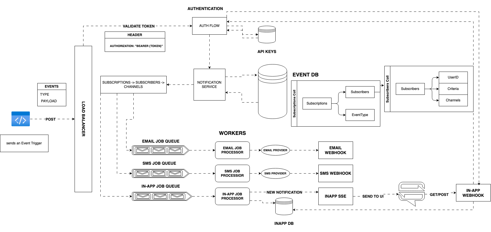

```
└── 📁shared
    └── 📁src
        └── 📁constants
            ├── errorCodes.ts
            ├── queueNames.ts
        └── 📁interfaces
            ├── error.ts
            ├── IDatabase.ts
            ├── ILogger.ts
            ├── IMessageQueue.ts
        └── 📁middleware
            ├── errorHandler.ts
            ├── healthCheck.ts
            ├── logEvents.ts
            ├── logger.ts
        └── 📁types
            ├── notification.types.ts
            ├── queue.types.ts
            ├── user.types.ts
        └── 📁utils
            ├── database.ts
            ├── messageQueue.ts
            ├── retry.ts
        └── index.ts
```